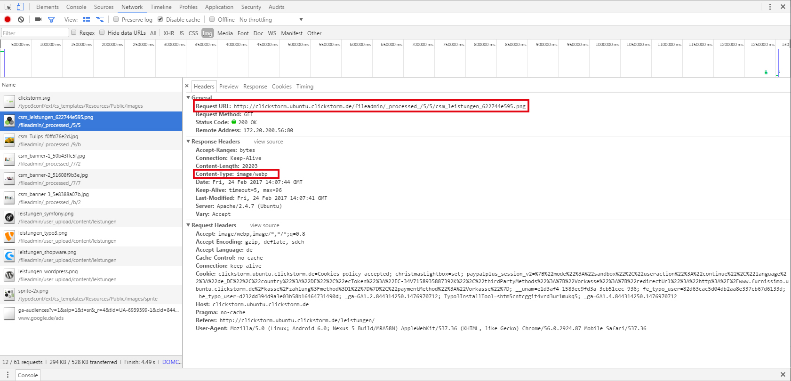
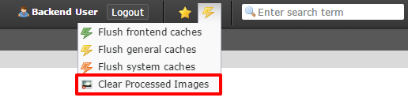

.. ==================================================
.. FOR YOUR INFORMATION
.. --------------------------------------------------
.. -*- coding: utf-8 -*- with BOM.

.. include:: ../Includes.txt

.. _introduction:

Introduction
============

.. _what-it-does:

What does it do?
----------------

The extension copies and converts all png and jpg images in the fileadmin/_processed_ folder to the webp format. Browser which could read webp images load the webp images instead of the jpg or png files. The webp images are generated when new processed images in jpg or png format are added in the _processed_ folder.

You can reach more Points on Google PageSpeed Insights if webp images are rendered.

On the other hand the extension adds a link to the clear cache menu (flush caches) for editors and admins. On click the processed images will be
deleted like the button in the install tool would do. But with this action the webp images are deleted also. Afterwards the frontend cache is cleared automatically.

This link in the clear cache menu could be deactivated for editors. For this just add options.clearCache.tx_cswebp = 0 in the UserTSConfig.

.. important::

   Every jpg or png image is stored as webp file a second time in the folder (bigger storage size).

.. _installation:

Installation
----------------

- install the extension
- clear the processed images in the install tool
- reload the backend
- add the code in the head of your root .htaccess file. This .htaccess Code rewrites the jpg and png images to the webp files if webp is readable in the browser.
- change the level of quality if needed in the extension configuration in extension manager (default 70)

.. code-block:: php

    <IfModule mod_rewrite.c>
        RewriteEngine On
        RewriteCond %{HTTP_ACCEPT} image/webp
        RewriteCond %{DOCUMENT_ROOT}/$1.webp -f
        RewriteRule ^(fileadmin/_processed_.+)\.(jpe?g|png)$ $1.webp [T=image/webp,E=accept:1]
    </IfModule>

    <IfModule mod_headers.c>
        Header append Vary Accept env=REDIRECT_accept
    </IfModule>

    AddType image/webp .webp

.. _check-if-webp-images-are-rendered:

Check if webp images are rendered
----------------

   You can check if the webp image is rendered in the network section in your developer tool of the browser.
   If the response header of the image is image/webp, the webp image is rendered. Notice that the filename itself doesn't change to webp.

.. _screenshots:

Screenshots
-----------

   The clear processed images and webp images link for editors and admins.